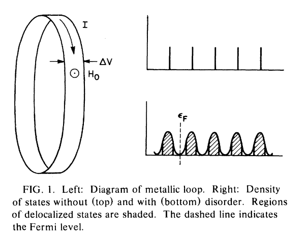
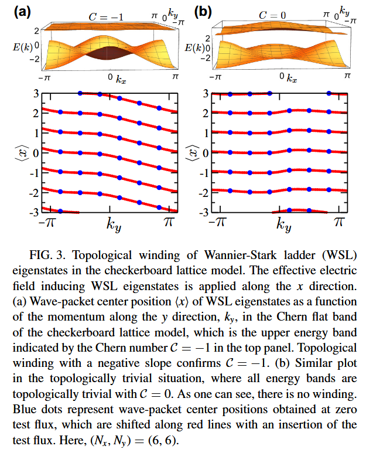
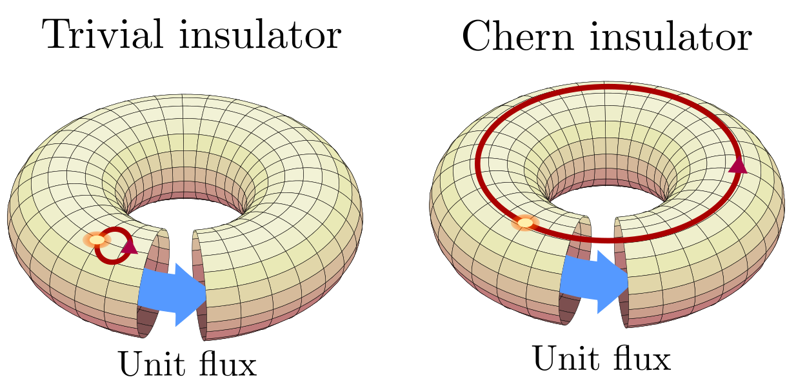
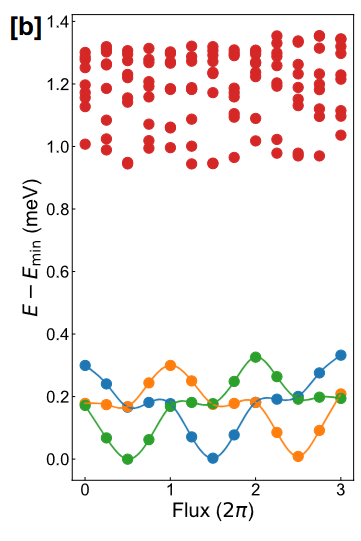

电荷泵浦如何对应拓扑性质？

<!-- more -->

```textile
本文是对于 https://arxiv.org/abs/2604.08702 的一些想法
周期性体系中，多体波函数电极化随外加磁通的变化可以对应体系拓扑性质；
可以利用这个关系确认体系拓扑性质，尤其是可以适用于分数陈绝缘体。
下文取自然单位制
```

本文目前修订中，占位

## INTRO: (单体的) 拓扑泵浦

### Laughlin's argument & Thouless pumping

我们从无相互作用系统开始，先考虑单粒子波函数的 pumping。

Laughlin 提出思想实验：对于无相互作用电子气中的整数量子霍尔效应 (下图左)，外加单位磁通后，总的波函数 (在规范变换的意义下) 不变；

如果这个过程中，单电子波函数从一个局域中心移动到了另一个局域中心 (下图右上)，那么就对应着


<figure>

</figure>

在晶格体系中，也有类似 pumping；

<figure>

<figcaption> Wannier 波函数的 pumping；$y$ 方向取 Bloch 态，$x$ 方向局域化为 Wannier 态。随着 $k_y$ 的从 $-\pi$ 变化到 $\pi$，$x$ 方向的波函数局域中心要么移动若干个原胞 (拓扑态)，要么回到原来位置 (平庸态) [<i>PRR 5, 033212 (2023)</i>] </figcaption>
</figure>

## (多体的) 整数泵浦

### 如何定义多体陈数?

在多体情况下，没有良好定义的能带，因此需要通过绝热演化定义。一个经常使用的定义是外加磁通下的演化。x,y 方向的磁通分别从 $0$ 变化到 $2\pi$，形成了一个有效布里渊区。其中每个磁通的电子态的周期部分，都可以定义出 Berry connection, Berry curvature，比如

$$
\mathcal{A}_{\mu} = i \langle\Phi | \partial_{\mu} \Phi \rangle
$$

也就是需要计算不同磁通下的 $|\Phi\rangle$。计算中会计算 twisted boundary condition 下的基态波函数 $\psi_\theta$，满足

也就是 $H_\theta = e^{i\theta \sum_j x_j} H e^{-i \theta \sum_j x_j}$ 在周期性边界条件下的基态波函数， $\psi_{\theta}(x+L) = e^{i \theta} \psi_{\theta} (x)$ ，其中 $\psi_{\theta}(x) = e^{i \theta \frac{\sum_j x_j}{L_x} } \Phi_{\theta}(x)$.

### 如何表示多体电荷中心 ?

很显然，在周期性条件下，比较自然的单粒子坐标定义是 $x \rightarrow \exp(i b x)$；$b$ 是**超胞**倒格矢。如果要 generalize 到多体情形，比较自然的选取方法是：

1. $\{x_1,x_2\cdots\}\rightarrow \exp(i b \sum_j x_j)$

2. ${x_1,x_2\cdots}\rightarrow \sum_j \exp(ibx_j)$

考虑到: 1) 我们需要的是“电荷中心”的位置； 2) 如果电子完全局域，后面的式子是 0；所以这里，多体电子位置的合理取法是 1，这也就是 Resta's polarization operator。

> 值得注意的是，尽管 Resta 的算符中 $b$ 取超胞倒格子的基矢，但选其他的倒格子矢量也是合法的；我们在下面会用到这一点来简化计算

电极化的改变量对应电荷的输运过程。在开边界下，很自然地可以对应

$$
P=\sum_j r_j \tag{1}
$$

在周期性的条件下，需要将上式周期化。Resta 将电极化算符定义为 

$$
\hat{Z}_{\mu}=\exp(i b_{\mu} \sum_j \hat{r}_i) \tag{2}
$$

其中 $b_\mu$ 对应于 $\mu$ 方向上的原胞倒格矢。直观上，Resta's polarization operator 的幅角就对应于电极化的值。

> BTW 这个电极化算符的模长对应电子的局域化程度，可以用于区分金属和绝缘体。

现代电极化理论中，

$$
\frac{\text{d}}{\text{d}t} \ln \langle Z \rangle= J
$$

因此我们可以追踪多体电极化的相位，来看外加磁通过程中的绝热输运。

### 极化、泵浦、陈数

我们现在知道: 

1. 绝热磁通插入下，电荷的输运 → 拓扑性质

2. 多体电极化改变 → 电荷的输运

3. 拓扑性质 ← 拓扑不变量

合起来，**绝热磁通插入下的多体电极化的变化对应拓扑不变量**

<figure>
  
  <figcaption>黄点是极化的相位，蓝箭头是单位磁通插入，红箭头是极化相位变化的轨迹 </figcaption>
</figure>

## (多体的) 分数泵浦

### Spectral flow

分数陈绝缘体始终存在基态简并，这种简并由质心平移对称性保证。

因此，在外加多个单位磁通后，分数陈绝缘体才能回到初始状态。

> 作为对比，整数情形下，外加单位磁通后，系统回到原来状态。

<figure>
  
  <figcaption> 2/3 filling FCI 态的 spectral flow；最下面的彩线是基态，外加磁通时这些基态相互交换位置，经过 $6\pi$ 的周期后回到初始状态。 [<i>arXiv:2503.11756</i>]</figcaption>
</figure>

如果限定在第一布里渊区中，总是需要处理简并基态张成的子空间。

而如果扩大有效布里渊区，就可以只追踪其中一个态的变化情况，来。

### 基于 polarization 的 pumping

对于没有简并的情形，polarization  $\propto \ln{\langle \psi | \hat{Z} | \psi \rangle}$；
对于简并基态的空间，polarization 应当对于子空间中的旋转不变，因此需要是  $\propto \ln \det{\langle \psi_i | \hat{Z} | \psi_j\rangle}$. 

> 如果考虑到非正交的话 ，$\propto \ln \det({\mathbf{S}^{-1} \mathbf{Z}})$

这个量 *应当* 在单位磁通插入后，回到原先的位置；因此每个态 *平均* 的陈数是分数。

但是这个算符涉及到波函数之间的交叠，理论上可以算，但比较麻烦。

我们一般是通过 momentum sector 来区分不同的近简并基态，这会使得极化算符中很多矩阵元可以是 0；如果我们恰当选取 $Z_{b}$ 中的 $b$，很多矩阵元会消失；由于 $Z_b$ 是动量空间的平移算符，仅仅 $K_i = (K_j + N_e b)$ 时 (在布里渊区平移的意义下)，矩阵元才不为 0.

我们选择 

$$
N_e \mathbf{b} = m \mathbf{G}_x + n \mathbf{G}_y \tag{3}
$$

那么只有同个 sector 中的矩阵元不为 0.

## MISC.

**为什么是直线？** 直观上，多体的 Berry curvature 很平 (随着粒子数指数变平, ref. [])；

**什么时候这个方法会裂开？** 这个方法的想法基于绝热演化，当随着 flux 变化，波函数从一个
